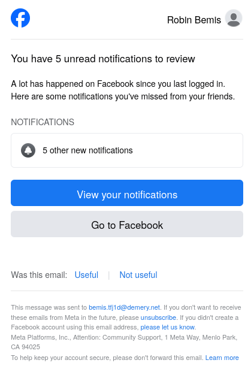
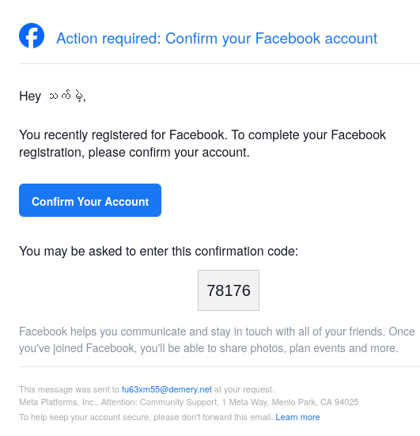
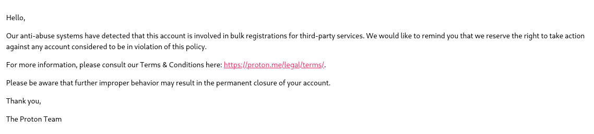

For over a year I have been receiving emails from facebookmail.com for accounts that I have never created. Here are some examples:

When examining the headers of the email everything looks legitimate, as far as I can tell these emails are intentionally sent by facebook. I have not included the headers in this post because I don't want to encourage even more spam landing in my inbox... The majority of the emails are to this "Robin Bemis" account.

You may notice that in one of the example emails there is a link you can click to report this email as not belonging to you, this is something I have tried multiple times. Usually I get an error that the link has expired (as these emails are in my spam I am often not very quick to react and it seems like the timeout is quite short). Another time I just got an error that the link is invalid and I must have copied it incorrectly (not really possible since I clicked on the link...).

Over the last two months the volume of these emails have increased, they land in my spam inbox so they don't annoy me day-to-day but I still wanted to investigate.

I started by reporting an issue to facebook, they don't seem to have much documentation about getting in touch with them about this kind of thing. So at first I have reported it by logging into my (mostly-unused) facebook account and using their "Report Issue" feature under the notification category. I included a screenshot of one of the problem-emails and the details that (a) the account was not created by me, and (b) I cannot report it as not belonging to me. I would have expected to get some acknowlegement of submitting this report but did not by email or within the app. I am unsure if I will get a response.

Strangely, the following day I received the following email from proton (my email provider):

Either this is a coincidence (I have never received an email like this from proton in the past) or facebook may have actioned my reported issue by reporting the catch-all emails as being abused (pretty nasty since I explicitly stated I did not create the account). 

Next I submitted an issue to Proton telling the story up to this point, including a screenshot of a problem email and that I have already reported this to facebook. As of this post I have not yet heard back.

My current theory is that some bots abuse known catch-all mails to attempt to create many facebook accounts, this requires entering a 5 digit code sent in an email. Since there is a 1 in 100000 chance of guessing the code they simply need to get enough volume of these emails out and guess the code randomly to create facebook accounts linked to random catch-all emails. Perhaps the Robin Bemis account is an example of this suceeding. However, it does seem like an awful amount of trouble to go to get some facebook accounts, so please feel reach out if you have any other ideass!

If I hear more back from facebook and/or proton I will write a follow-up post. I am also considering trying a password reset of the Robin Bemis account and seeing if I can get in and if so what kind of things the account as been up to, and if there are any clues about who runs it (however I am a little worried about the legal ramifications of taking over the account and if it will increase the likelihood of having my proton account reported).
